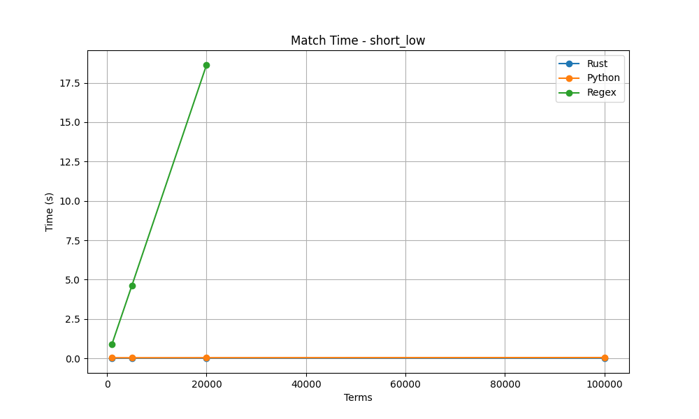

# FlashText i18n
## 現代化、高效能的 FlashText (Rust 核心)

[English](README.md) | [繁體中文](README_zh-TW.md)

**基於 Rust 打造的高效能關鍵詞提取與替換函式庫。**

這是原始 FlashText 演算法的 **全面現代化版本**。雖然最初只是一個修復國際化 (i18n) 問題的分支，但現在已演變為一個使用 Rust 重寫的全功能高效能引擎。

它提供了 **3倍到4倍的效能提升**、**100% 正確的 Unicode 處理**，以及 **新功能** (模糊匹配、混合大小寫支援)，同時保持 API 的完全相容性。

[](https://badge.fury.io/py/flashtext-i18n)
[](https://pypi.org/project/flashtext-i18n/)
[](https://opensource.org/licenses/MIT)

## 為什麼選擇這個版本而不是原版？

原始的 `flashtext` 庫已多年未維護，且存在根本性的問題：
- ❌ **錯誤的單詞邊界**: 在非 ASCII 字符上失敗 (例如 CJK 相鄰詞、德語 `ß`、法語 `é`)。
- ❌ **效能瓶頸**: 純 Python 實作在大量關鍵詞時會遇到瓶頸。
- ❌ **無模糊匹配**: 無法處理拼字錯誤或微小差異。

**FlashText i18n (v4.0) 解決了所有這些問題：**

1.  **Rust 核心 (極速)**: 繁重的計算在 Rust 中完成，提供相同的 O(N) 複雜度，但擁有 **~4x 的原始吞吐量** 和穩定的記憶體擴展性。
2.  **真正的 Unicode 支援**: 我們使用 Rust 強大的 `unicode-segmentation` 來正確識別 **任何語言** 的單詞邊界 (中文、日文、韓文、泰文、印地語等)。
3.  **擴展功能**:
    - **模糊匹配**: 支援 Levenshtein 距離，可提取輕微拼錯的關鍵詞。
    - **混合大小寫模式**: 支援同時存在區分大小寫和不分大小寫的關鍵詞。
    - **豐富元數據**: 提取詳細的跨度 (start/end) 和替換資訊。
4.  **無痛替換 (Drop-in Replacement)**: 你只需更改一行程式碼 (或安裝指令) 即可從 `flashtext` 切換過來。

---

## 版本歷史

### v4.0.0 (Rust 時代) - *Alpha*
- **Rust 整合**: 核心邏輯用 Rust 重寫，兼具速度與安全性。
- **新功能**: 模糊匹配、JSON 檔案載入、句子提取。
- **通用 Wheels**: 為 Windows, macOS (Intel/Silicon), Linux (gnu/musl) 和 Aarch64 提供預編譯的二進制檔案。
- **國際化單詞邊界**: Unicode 感知的邊界檢測。
- **從檔案載入關鍵詞**: 支援 JSON/Text 檔案。
- **混合大小寫支援**: 支援區分與不分大小寫並存。
- **模糊匹配**: 可選的 Levenshtein 距離支援。
- **新 API**: 提取句子、替換元數據 (metadata)。

### v3.0.0 (Python Core) - *已發布*
- **Unicode 大小寫轉換**: 修正土耳其語 `İ` 和德語 `ß` span 位置。
- **數字**: 關鍵詞後接數字可正確提取。
- **CJK 支援**: 正確提取相鄰的中文/日文關鍵詞。

## 功能亮點

### 國際化單詞邊界 (v4.0)

原始 FlashText 僅支援 ASCII 字符 (`A-Za-z0-9_`) 作為單詞的一部分。這導致許多語言中的字符（如 `é`, `ß`, `ç`）被錯誤地視為分隔符，從而切斷單詞。

**v4.0 修復**: 默認情況下，所有合法的 Unicode 字母數字字符都會被視為單詞的一部分。

```python
# 印地語 (Devanagari)
kp.add_keyword('नमस्ते')
kp.extract_keywords('नमस्ते दुनिया') 
# ✅ ['नमस्ते'] (之前版本會失敗)

# 法語/德語
kp.add_keyword('café')
kp.extract_keywords('I went to a café.') 
# ✅ ['café'] (之前版本會只提取 'caf')
```

### CJK 相鄰關鍵詞 (v3.0)

```python
from flashtext import KeywordProcessor

kp = KeywordProcessor()
kp.add_keyword('雅詩蘭黛')  # Estée Lauder
kp.add_keyword('小棕瓶')    # Advanced Night Repair

text = '推薦雅詩蘭黛小棕瓶超好用'
result = kp.extract_keywords(text)
# Original FlashText: ['雅詩蘭黛']  ❌ 漏掉了 '小棕瓶'
# FlashText i18n:     ['雅詩蘭黛', '小棕瓶']  ✅ 兩個都提取到了！
```

### 從檔案載入關鍵詞 (v4.0)

現在可以直接從 JSON 或純文字檔案載入關鍵詞。

```python
# keywords.json
# {
#    "Color": ["red", "blue", "green"],
#    "Vehicle": ["car", "bike"]
# }

kp.add_keywords_from_file('keywords.json')
```

## 安裝說明

```bash
pip install flashtext-i18n
```

> **注意**: 本套件提供了一個名為 `flashtext` 的模組作為直接替換 (drop-in replacement)。請務必先 **移除 (uninstall)** 原始的 `flashtext` 套件以避免衝突。
> ```bash
> pip uninstall -y flashtext
> pip uninstall -y flashtext-i18n # 可選，確保環境乾淨
> pip install -U flashtext-i18n
> ```

或者使用 [uv](https://github.com/astral-sh/uv):

```bash
uv pip install flashtext-i18n
```

或者直接從 GitHub 安裝:

```bash
pip install git+https://github.com/termdock/flashtext-i18n.git
```

## 使用範例

API 與原始 FlashText 100% 相容：

```python
from flashtext import KeywordProcessor

# 建立處理器
kp = KeywordProcessor()

# 新增關鍵詞
kp.add_keyword('Python')
kp.add_keyword('機器學習', 'Machine Learning')

# 提取關鍵詞
text = 'I love Python and 機器學習'
keywords = kp.extract_keywords(text)
# ['Python', 'Machine Learning']

# 提取並包含位置資訊 (span info)
keywords_with_span = kp.extract_keywords(text, span_info=True)
# [('Python', 7, 13), ('Machine Learning', 18, 22)]

# 替換關鍵詞
new_text = kp.replace_keywords(text)
# 'I love Python and Machine Learning'

# 獲取替換詳情 (v4.0 新增)
new_text, replacements = kp.replace_keywords(text, span_info=True)
# replacements = [
#     {'original': 'Python', 'replacement': 'Python', 'start': 7, 'end': 13},
#     {'original': '機器學習', 'replacement': 'Machine Learning', 'start': 18, 'end': 22}
# ]


# 提取包含關鍵詞的句子 (v4.0 新增)
sentences = kp.extract_sentences(text)
# [('I love Python and 機器學習', ['Python', 'Machine Learning'])]

# 獲取關鍵詞總數
print(len(kp))
# 2

# 一個關鍵詞對應多個標籤 (v4.0 新增)
kp.add_keyword('Apple', ['Fruit', 'Tech'])
keywords = kp.extract_keywords('I have an Apple')
# ['Fruit', 'Tech']

# 混合大小寫支援 (Case-Sensitive & Case-Insensitive) (v4.0 新增)
# 預設: case_sensitive=False (全域設定)
kp = KeywordProcessor()

# 新增不分大小寫關鍵詞 (匹配 'banana', 'Banana', 'BANANA')
kp.add_keyword('banana')

# 新增區分大小寫關鍵詞 (僅匹配 'Apple')
kp.add_keyword('Apple', case_sensitive=True)

keywords_found = kp.extract_keywords('I like Apple and Banana.')
# ['Apple', 'banana']

keywords_found = kp.extract_keywords('I like apple and BANANA.')
# ['banana'] (嚴格匹配的 'Apple' 不會匹配 'apple')
```

> **Note**: 這是 **共享 Trie 路徑的設計權衡 (Tradeoff)**。如果你新增 `Apple` (區分大小寫) 和 `apple` (不分大小寫)，它們會共享 `a-p-p-l-e` 這條路徑。最後加入的定義將會生效。 **建議**: 如果你需要嚴格區分，請在不分大小寫的關鍵詞 *之後* 加入區分大小寫的關鍵詞。

### 模糊匹配 (Levenshtein Distance)

FlashText 支援模糊匹配以處理拼字錯誤。

> **警告**: 模糊匹配會引入額外的編輯距離計算成本，效能 **顯著低於** 精確匹配。請僅在必要時使用。

使用 `max_cost` 指定允許的最大 Levenshtein 距離。

```python
kp = KeywordProcessor()
kp.add_keyword('Machine Learning')

# 精確匹配
kp.extract_keywords('I love Machine Learning')
# ['Machine Learning']

# 模糊匹配 (max_cost=2) -> 匹配 "Mchine Larning" (2 個刪除)
kp.extract_keywords('I love Mchine Larning', max_cost=2)
# ['Machine Learning']

# CJK 模糊匹配 (v4.0 新增)
kp.add_keyword('人工智慧')
# 匹配 "人工智障" (1 個替換)
kp.extract_keywords('這有人工智障功能', max_cost=1)
# ['人工智慧']
```

## 效能表現 (v4.0 Rust 核心)

比較 **FlashText 4.0 (Rust)**、**FlashText 3.0 (Python)** 以及 **Regex (編譯後)**。

### 基準測試方法 (Methodology)

- **Corpus**: 10,000 行文本 (短句，模擬自然語言)。
- **Terms**: 1,000 到 100,000 個唯一關鍵詞。
- **Metric**: 中位數匹配時間 (秒)，運行 10 次迭代 (啟用 Warmup)。
- **Environment**: Apple Silicon (M1/M2/M3), Python 3.11.

### 結果: 關鍵詞提取時間 (越低越好)

| 關鍵詞數量 | Rust (v4.0) | Python (v3.0) | Regex | 加速比 (vs Py) | 加速比 (vs Re) |
|---------:|------------:|--------------:|------:|----------------:|----------------:|
| 1,000    | **0.012s**  | 0.043s        | 0.92s | **3.6x**        | 76x             |
| 5,000    | **0.013s**  | 0.042s        | 4.80s | **3.2x**        | 369x            |
| 20,000   | **0.018s**  | 0.046s        | 19.16s| **2.6x**        | **1064x**       |
| 100,000  | **0.021s**  | 0.056s        | N/A   | **2.7x**        | N/A             |

> **Note**: 在此語料庫測試中，Rust 的匹配延遲隨關鍵詞數量增加 **幾乎保持常數**。Regex 的效能則隨著選項 (alternations) 增加而急劇下降，不適合用於大量關鍵詞。Rust 減少了每個字符的處理開銷與記憶體分配，因此相較於 Python 實作有一致的 **2.6倍到3.6倍** 加速。


*(圖 1: 與 Regex 比較 - Rust 快 1000 倍)*


*(圖 2: 與 Python 比較 - Rust 快約 3 倍且擴展性更好)*

### 建構時間 (Index Construction)

| 關鍵詞數量 | Rust (v4.0) | Python (v3.0) |
|---------:|------------:|--------------:|
| 100,000  | **0.08s**   | 0.17s         |

Rust 建構關鍵詞 Trie 索引的速度比 Python 快 2 倍。
*(Build time 於相同機器 Release build 測得，取 10 次迭代平均)*

## Roadmap

請查看 [Issues](https://github.com/termdock/flashtext-i18n/issues) 了解計畫中的修復：

- [x] Unicode 大小寫轉換 span 修正 (土耳其語 İ, 德語 ß) (Fixed in v3.0.0)
- [x] 關鍵詞後接數字的提取修正 (Fixed in v3.0.0)
- [x] 國際化單詞邊界檢測 (Fixed in v4.0)
- [x] 印度語言 (Devanagari) 支援 (Fixed in v4.0)
- [x] 從 JSON/Text 檔案載入關鍵詞 (Fixed in v4.0)

## Credits

本專案是 [FlashText](https://github.com/vi3k6i5/flashtext) 的 Fork，原作者為 [Vikash Singh](https://github.com/vi3k6i5).

原始 FlashText 演算法描述於論文: [Replace or Retrieve Keywords In Documents at Scale](https://arxiv.org/abs/1711.00046)

## License

MIT License - 詳見 [LICENSE](LICENSE) 檔案。

原始版權屬於 Vikash Singh (2017). 本分支由 [termdock](https://github.com/termdock) & Huang Chung Yi 維護。
